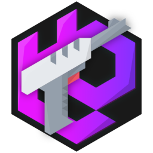

# tileblaster



tileblaster is a versatile caching proxy server for map tiles. it can handle many different tile sources and file formats
and can optimise tiles on the fly and speed up delivery by acting as a cache.

## Awesome things you can do with tileblaster

* Serve tiles from any ZXY/TMS tileserver, [VersaTiles container](https://versatiles.org/), pmtiles container or mbtiles database.
* Edit vector tiles on the fly with [Vector Tile Transformer](https://www.npmjs.com/package/vtt)
* Optimize raster tiles with `mozjpeg` / `optipng`, convert them to `webp` / `aviv` format on the fly or edit them with [sharp](https://www.npmjs.com/package/sharp).
* Precompress tiles with `gzip` and `brotli`
* Cache remote files locally

and much more

## What tileblaster isn't

tileblaster is not a tileserver, it does not read raw OpenStreetMap data or create map tiles from scratch; you need to
have a source for map tiles. You can of course use tools like [tilemaker](https://tilemaker.org/) to create your own
tilesets, use freely available ready-made tiles from [Versatiles](https://versatiles.org/) or use another tileserver
if you're allowed to do so.

## Install

`npm i -g tileblaster`

## Usage

`tileblaster [options] [-c] config.js`

### Options

* `-c` `--config <config.js>` - load config file
* `-p` `--port <[host:]port>` - listen on this port (overrides config)
* `-s` `--socket <socket[,mode,gid]>` -  on this socket (overrides config)
* `-t` `--threads <num>` - number of threads (overrides config)
* `-h` `--help` - print help screen
* `-v` `--verbose` - enable debug output
* `-q` `--quiet` - disable debug output

## Configuration

See [Configuration](docs/config.md) and [Examples](docs/examples.md)

### Plugins

tileblaster supports plugins. They work just like builtins, but you can specify them in `config.plugins`

[Example Plugin](plugins/example.js)

### Nginx

tileblaster is easy to use with nginx acting as a reverse proxy. Here is a simple example:

```
upstream tileblaster {
	server 127.0.0.1:28897;
	# server unix:/path/to/tileblaster.socket; # ← if you use sockets
}

server {

	# ...

	location /tileblaster { # ← set config.server.mount to the same path
		proxy_set_header Host $host;
		proxy_set_header Origin $http_origin;
		proxy_set_header Accept-Encoding $http_accept_encoding;
		proxy_set_header Accept-Language $http_accept_language;
		proxy_set_header Accept $http_accept;
		proxy_set_header If-Modified-Since $http_if_modified_since
		proxy_set_header If-None-Match $http_if_none_match
		proxy_http_version 1.1;
		proxy_pass http://tileblaster;
	}

}

```

## Optional Dependencies

tileblaster has a few optional dependencies, that are mostly used for image manilulation and optimisation (Sharp, MozJPEG, OptiPNG)  or more complex tile sources (Versatiles, PMTiles, MBTiles).

If you don't need them, install tileblaster with `npm i -g tileblaster --no-optional`

## License

[Unlicense](./UNLICENSE.md)
